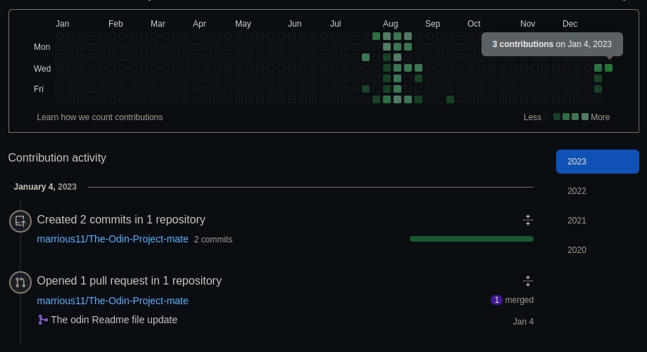
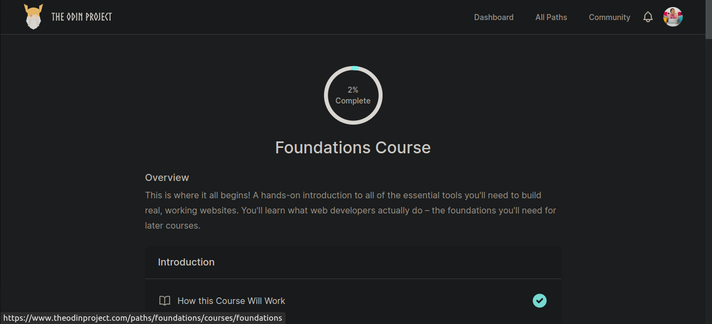

# The-Odin-Project-mate 🎉 👊
 The Odin Project is one of those "What I wish I had when I was learning" resources.
This project is designed to fill in the gap for people who are trying to hack it on their own but still want a high quality education.

#  Full Stack JavaScript- PROGRAM 2022/2023 💻

This is a repository where we will be sending our exercices and track our progrogress.

## How can I submit my work for the first time?

Prerequisite Fork and Make the project available locally. and clone the project form your repository.

How to fork a repo coul be ound [here](https://docs.github.com/en/get-started/quickstart/fork-a-repo)

###### Fork rule

  - fork the repository into yours
  - while you are doing the fork uncheck this box -->[copy the `main` branch only](#), to enable you to copy all the branches
  - now you are on your repository from here you click on code and copy the link as shown by the arrow
  - and you enter `git clone` plus the link you just copy 

Create a branch for the task

```
    git branch -M my-mates

    git checkout my-mates
```

After that, follow the steps below.
Step 1: under every question you create a new file having as name you github handle(username) (e.g (filename=`<marrius11.js>) and answer the question there
Step 2: Commit the change made and push

```
   git add <githubusername.js> 
   
    git commit -am "The odin exercise  from <githubHandle or githubusername>"

    git push -u origin my-mates or git push --set-upstream origin my-mates
```

**if you did many question at once use:**

```
   git add .
   
    git commit -am "The odin exercises[1 to 3] from <githubHandle or githubusername>"

   git push -u origin my-mates
```

Come back to our github repo here and do a pull request.


## Submission

To submit your task, create a pull request to this repository. You can find more information about how to create a pull request [here](https://docs.github.com/en/github/collaborating-with-issues-and-pull-requests/creating-a-pull-request).

- Done!

## Second submission
 
 just continue from step 1


## To Check for Updates

This command will help  us stay up to date with changes made in the Odin project repository.
So, before you start writing code and carrying out `git commands and pull requests`, first run the update command.

```
git push origin HEAD
```
## How to send feedback to the _WhatsApp chat_

> Use git related verbs like: commits, contribution, push, etc 
> Sample screenshot of your github contribution 
[^note]:
- [x]  💻  Yesterday (x-x-23), I was able to make # contributions.
 1) I worked on the Odin Project's  repo
 2) I was able to create and new branch called " my-mates", which was later merged with the master branch successfully without any merge conflicts
 > Sample screenshot of your Odin progress challeng 
 3) I was able to complete 2% of  a section on the foundations course on the Odin project website.
 4) For today day X( x-x-23) I will continue working on the  foundation course-Introduction to Web Development


### Further reading [on how to wite a ReandMe file](https://docs.github.com/en/get-started/writing-on-github/getting-started-with-writing-and-formatting-on-github/basic-writing-and-formatting-syntax)
